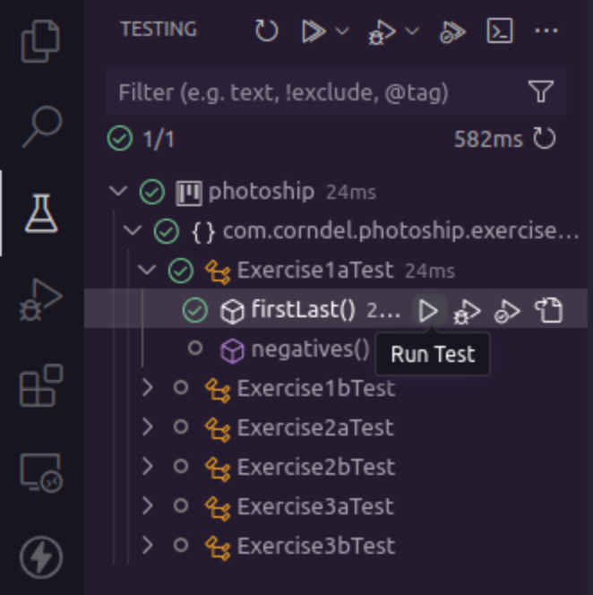
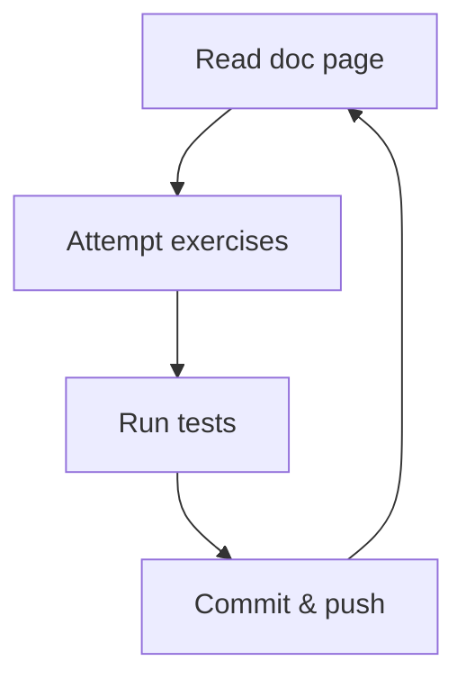

<p align="center">
  
</p>

# Photoship

**Photoship** is a revolutionary image processing tool which allows anyone to
edit images in the most astounding ways!

- Flip the image? No problem!
- Make it black and white? Easy!
- Use AI to give everyone facial tattoos? Planned for a future release!

## Getting started

1. Make sure your machine is set up according to the instructions with

   - [bash](https://tech-docs.corndel.com/bash/)
   - [vscode](https://tech-docs.corndel.com/vscode/)
   - [git](https://tech-docs.corndel.com/git/)
   - [java and maven](https://tech-docs.corndel.com/java/installation.html)

1. Clone the repository (i.e. download it), so you have a copy on your machine:

   ```bash
   git clone <your-repository-url>
   ```

1. Once cloned, open a terminal in the project folder, and run

   ```bash
   ./mvnw clean compile
   ```

   You should see some output in the terminal saying the build is successful. If
   you've got this far, great! You're on track.

## Running tests

To check if your solution for one of the exercises has worked, you can run the
tests.

You can run them using either method below:

### Option 1: Using VSCode

You can open up the "Testing" tab and press play on the test or group of tests
you want to run.



### Option 2: Using the CLI

To check if your solution for one of the exercises has worked, you can run the
command

```bash
./mvnw test
```

in the terminal.

> [!TIP]
>
> You can choose which test to run usin the `-Dtest=` parameter. E.g. Runnning
>
> ```bash
> ./mvnw test -Dtest=Exercise1aTest
> ```
>
> in the terminal will test only the `Exercise1a.java` code using the
> `Exercise1aTest.java` test file.

## Deep dive

Before working on the Photoship project, there are a few things we need to
learn. There are some documentation pages which will teach you what you need to
know, and some exercises for you to practice your skills.



### Arrays and Lists

1. Read the docs on
   [array basics](https://tech-docs.corndel.com/java/arrays.html).

1. Complete Exercise 1a:

   - You'll find it in
     `src/main/java/com/corndel/photoship/exercises/Exercise1a.java`.

   - Run the tests to see if you got it right!

   - Once you pass the tests, type `git commit -am "Solves 1a"` in the terminal
     and hit enter to commit your solution.

   - Now type `git push` to sync your changes to github.

1. Read the docs on [lists](https://tech-docs.corndel.com/java/lists.html).

1. Solve, commit and push Exercise 1b.

### List techniques

1. Read the docs on
   [list techniques](https://tech-docs.corndel.com/java/list-techniques.html).

1. Solve, commit and push Exercise 2a.

1. Read the docs on
   [map and filter](https://tech-docs.corndel.com/java/map-filter.html).

1. Solve, commit and push Exercise 2b.

### Working with strings

1. Read the docs on
   [string formatting](https://tech-docs.corndel.com/java/string-formatting.html).

1. Solve, commit and push Exercise 3a.

1. Solve, commit and push Exercise 3b.

There are some additional readings on
[array techniques](https://tech-docs.corndel.com/java/array-techniques.html) and
[splitting strings](https://tech-docs.corndel.com/java/string-split-join.html)
which you should take a look at if you have time,

## Workshop

Once the deep dive is complete, you're ready to get started working on
Photoship!

Find the `CONTRIBUTING.md` file for your next instructions.
